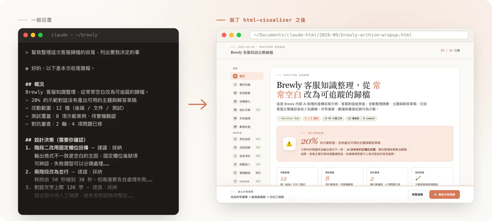
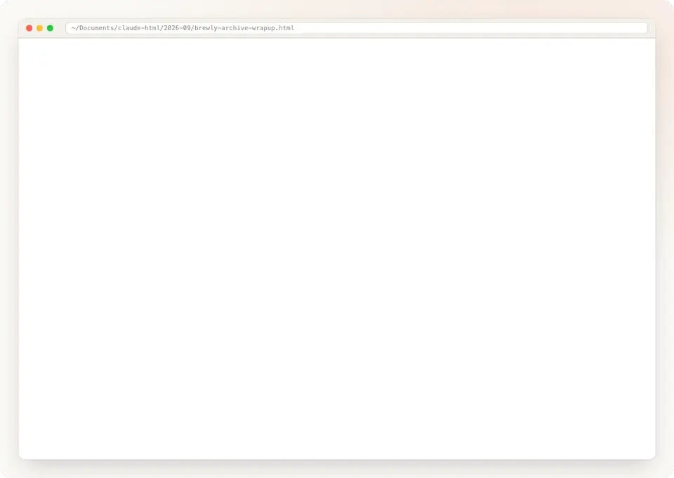
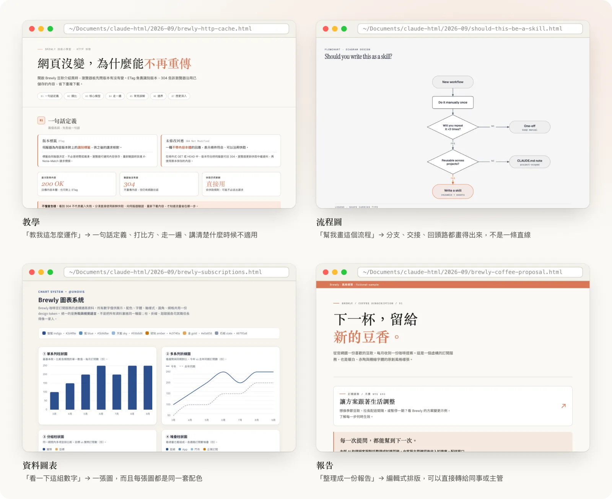
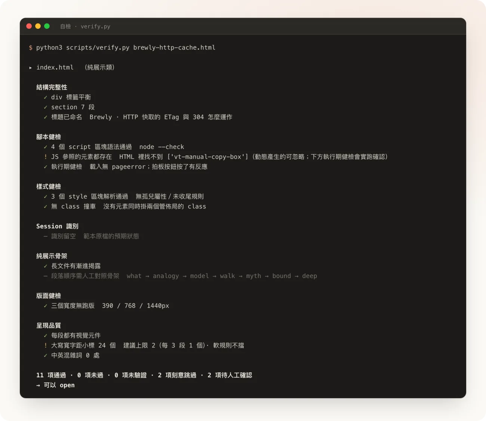

# html-visualizer

> [English](README.en.md)

**讓 AI 把長篇回覆做成一份好看好讀的網頁，而不是一大片文字。**



同一個問題，左邊是你現在會拿到的回覆，右邊是裝了之後拿到的頁面。

[看它長什麼樣](#長這樣) · [安裝](#安裝) · [常見問題](#常見問題)

---

## 它解決什麼

你問 AI 一個問題，它回你三百行文字。內容也許都對，但你得從頭捲到尾，看完前面忘記後面。

裝了這個之後，同樣的問題會得到一份網頁：有目錄可以跳、有表格可以對照、該畫圖的地方真的畫成圖。看完就懂，也可以直接把檔案傳給同事。

**你不用學新指令，也不用改變說話方式。** 內容夠長的時候它自己會出現；不想要的時候說一句「給我純文字就好」。

---

## 長這樣

### 要你做決定的時候：在頁面上選好，一鍵貼回



AI 需要你拍板的事，每一題就放在它的說明旁邊，選項和補充框在同一張卡上。選完按「複製決策摘要」貼回對話，AI 就照你的決定往下做。不用再打「第一題選 A、第二題我想改成……」。

### 不同的內容，給不同的版型



它會看內容挑版型，不是每次都套同一個模板：

| 你這樣說 | 你會拿到 |
|---|---|
| 「幫我整理這份會議記錄」 | 一頁重點整理：結論放最前面，細節分段收好，待辦事項獨立列出 |
| 「教我這個東西怎麼運作」 | 一頁教學：先一句話說完，再打個比方，然後帶你走一遍，最後告訴你什麼情況不適用 |
| 「這幾個做法我該選哪個」 | 一頁比較表，還可以直接在頁面上勾選，選完按一下複製，貼回去告訴 AI 你的決定 |
| 「把這份規劃拿給老闆看」 | 一頁給非技術主管看的說明：由上而下、配上畫面示意，藏掉看不懂的技術細節 |
| 「這組數字幫我看一下趨勢」 | 一張圖表，不是一堆數字 |
| 「這個流程幫我畫出來」 | 一張流程圖，分支、交接、回頭路都畫得出來 |

### 傳給同事，手機打開一樣好讀


產出是單一個 HTML 檔，用瀏覽器打開就能看。手機上會自動收掉桌機用的留白，把寬度留給內容。

### 給你看之前，它先自己檢查過

它會先用瀏覽器把頁面在手機、平板、桌機三種寬度真的打開一次，確認沒有跑版、文字沒被擠壞、按鈕按了有反應，都過了才交給你。細節見下面的〈技術細節〉。

---

## 安裝

**最簡單的方法**：把下面這行網址貼給你的 AI，跟它說「幫我安裝這個」。

```
https://github.com/chenjackle45/html-visualizer
```

就這樣。它會自己看說明、把東西放到正確的位置。裝完跟它說一聲「重新載入」，或把視窗關掉重開。

支援 Claude Code、Codex、Cursor、Cline、GitHub Copilot、OpenCode 等等，只要你的 AI 工具看得懂 skill 就能用。

<details>
<summary>想自己動手裝的話</summary>

**Claude Code** 有內建的套件管理，直接輸入：

```
/plugin marketplace add chenjackle45/html-visualizer
/plugin install html-visualizer@chenjackle45
```

用 `/plugin list` 確認裝好了。更新用 `/plugin update html-visualizer@chenjackle45`，移除用 `/plugin uninstall html-visualizer@chenjackle45`。

**claude.ai 網頁版 / Claude Cowork** 不吃 plugin，要把 skill 打包成 zip 上傳（Settings → Capabilities → Skills）。zip 的根目錄必須是 skill 資料夾本身，一個 skill 一個 zip：

```
git clone https://github.com/chenjackle45/html-visualizer.git
cd html-visualizer/skills
zip -r html-visualizer.zip html-visualizer
zip -r chart.zip chart
zip -r diagram-design.zip diagram-design
```

三個 zip 分別上傳。網頁版有兩個文件沒寫全的限制：`description` 最多 200 字元（Agent Skills 規格是 1024）、一個 zip 最多 200 個檔。本 repo 三份都已控制在內；自己改過 description 的話，上傳前跑 `python3 tests/check-frontmatter.py` 確認。

**其他工具**下載回來跑安裝腳本：

```
git clone https://github.com/chenjackle45/html-visualizer.git
cd html-visualizer
./install.sh --detect
```

`--detect` 會自動找到你電腦上各家 AI 工具放 skill 的資料夾，全部裝進去。其他選項：

| 指令 | 作用 |
|---|---|
| `./install.sh` | 裝到 `~/.agents/skills/`（多家工具共用的位置） |
| `./install.sh --dir <路徑>` | 裝到你指定的資料夾 |
| `./install.sh --copy` | 用複製取代捷徑 |
| `./install.sh --uninstall` | 移除 |

更新的話，在下載回來的資料夾跑 `git pull` 就好，不用重裝。

需要電腦上有 `python3`（3.8 以上）。

</details>

---

## 裝好之後怎麼用

**就照平常那樣講話。** 這幾句都會觸發它：

- 「幫我整理成一份報告」
- 「做一份給人看的版本」
- 「列出幾個選項讓我選」
- 「解釋這個給我聽」
- 「幫我畫一下這個流程」

沒觸發也沒關係，直接說「做成網頁給我看」就行。

產出會自動在瀏覽器打開，同時存到 `~/Documents/claude-html/`，還會建一份索引頁，方便你回頭找「上禮拜那份」。

---

## 常見問題

**AI 好像不知道有這個東西？**
關掉重開，或跟它說「重新載入 skill」。

**回覆還是一大片文字？**
內容太短的時候它刻意不出現，免得小事也丟一個網頁給你。想要的話直接說「做成網頁」。

**檢查結果寫「未驗證」是壞了嗎？**
不是。它會在給你看之前先檢查排版有沒有壞掉，這一步需要瀏覽器自動化工具 Playwright。沒裝就標「未驗證」，意思是「沒檢查」，不是「有問題」。電腦上有 Chrome 的話，`npm i -D playwright` 就夠了，它會直接借用你的 Chrome；沒有 Chrome 再加跑 `npx playwright install chromium`。

---

<details>
<summary>技術細節：這東西實際上在做什麼</summary>

它是三個 skill 的組合：

| Skill | 負責 |
|---|---|
| `html-visualizer` | 主要入口。挑版型、建頁、跑自檢、開給你看 |
| `chart` | 資料圖表，用 `@unovis` 畫，各種圖表共用一套配色 |
| `diagram-design` | 結構圖，手工排版的 SVG。[cathrynlavery/diagram-design](https://github.com/cathrynlavery/diagram-design) v2.6 的 fork |

**為什麼不是叫 AI 直接產 HTML 就好**：因為 AI 產的 HTML 會安靜地壞掉，而它自己看不到。所以在給你看之前會先跑一支自檢，每一項都對應一次真實事故：



| 檢查 | 擋掉的事故 |
|---|---|
| 每段程式碼跑語法檢查，再真的打開頁面按一次複製鈕 | 複製鈕按了完全沒反應。一次是一個換行字元弄壞整段程式，一次是頁面少了一塊、程式碰到空值就停了 |
| 每段樣式解析、抓多餘或沒收尾的括號 | 整頁完全沒有樣式，因為樣式被從中間切斷。當時數過括號，左右數量剛好相同所以看不出來 |
| 用瀏覽器在手機／平板／桌機三種寬度真的畫出來 | 同一頁桌機好好的、手機整片凸出去 |
| 四種「看不見的壞掉」：文字被壓成直排、元素被壓扁、對比太低、被蓋住 | 一份報告全部檢查都過，交出去被回報中文一個字一行 |
| 勾選題的線路一致性 | 你選了半天，複製出來的摘要漏掉三題 |

**跨工具運作**：沒有綁定任何一家。skill 的設定檔只用最通用的兩個欄位，腳本只需要 `python3` 和選配的 `node`。抓工作階段名稱時會依序試環境變數、Git 分支名、資料夾名；開檔時有瀏覽器工具就用，沒有就用系統的開檔指令，都不行就直接告訴你檔案在哪。

**設定**：

| 環境變數 | 作用 |
|---|---|
| `HTML_VISUALIZER_ARCHIVE_DIR` | 產出存放位置（預設 `~/Documents/claude-html`） |
| `HTML_VISUALIZER_PLAYWRIGHT_ROOT` | 額外的 Playwright 搜尋路徑 |

裝好後 `skills/html-visualizer/references/examples/` 有現成範例可以打開來看。

</details>

---

## 語言

Skill 的說明文字是繁體中文（作者的工作語言）。**產出頁面跟著你對話的語言走**，用英文聊天就得到英文頁面。

## 作者

Jackle Chen — [jackle.pro](https://jackle.pro/) · [@chenjackle45](https://github.com/chenjackle45)

有問題或建議請開 [issue](https://github.com/chenjackle45/html-visualizer/issues)。

## 致謝

- [diagram-design](https://github.com/cathrynlavery/diagram-design) by Cathryn Lavery — MIT。圖示來自 Tabler（MIT）、Simple Icons（CC0）、Devicon（MIT）、log-z/logos（MIT），詳見 `skills/diagram-design/THIRD_PARTY_LICENSES.md`。
- [@unovis](https://unovis.dev) — Apache-2.0，走 CDN 載入。
- [Tailwind CSS](https://tailwindcss.com) — MIT，走 CDN 載入。
- [Mermaid](https://mermaid.js.org) — MIT，只在你明講要 Mermaid 圖時才載入。
- code-shape 元件的概念參考 HumanLayer 的 *show-me* skill。
- 預設視覺風格取向於 Anthropic 的編輯式排版；沒有複製 Anthropic 的任何內容。

## 授權

MIT，見 `LICENSE`。第三方素材各自維持原本的授權。
